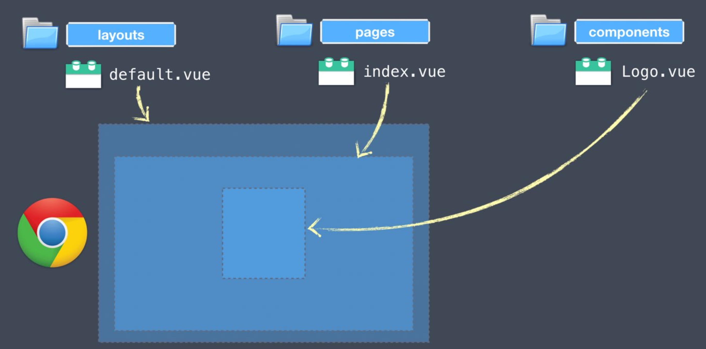

# learn-nuxt-myself

## 프로젝트 생성

```bash
$ npm init nuxt-app {프로젝트명}
```

## Build Setup

```bash
# install dependencies
$ npm install

# serve with hot reload at localhost:3000
$ npm run dev

# build for production and launch server
$ npm run build
$ npm run start

# generate static project
$ npm run generate
```

For detailed explanation on how things work, check out the [documentation](https://nuxtjs.org).

## Special Directories

You can create the following extra directories, some of which have special behaviors. Only `pages` is required; you can delete them if you don't want to use their functionality.

### `assets`

이미지, 웹 리소스 등을 위치

The assets directory contains your uncompiled assets such as Stylus or Sass files, images, or fonts.

More information about the usage of this directory in [the documentation](https://nuxtjs.org/docs/2.x/directory-structure/assets).

### `components`

The components directory contains your Vue.js components. Components make up the different parts of your page and can be reused and imported into your pages, layouts and even other components.

More information about the usage of this directory in [the documentation](https://nuxtjs.org/docs/2.x/directory-structure/components).

### `layouts`

라우터를 기준으로 특정 url에 접근했을 때 보여지게 될 페이지 컴포넌트

Layouts are a great help when you want to change the look and feel of your Nuxt app, whether you want to include a sidebar or have distinct layouts for mobile and desktop.

More information about the usage of this directory in [the documentation](https://nuxtjs.org/docs/2.x/directory-structure/layouts).

### `middleware`

SSR을 진행할 때 서버에서 브라우저로 어떠한 파일들을 넘기기 전에 항상 실행시키는 함수

### `pages`

This directory contains your application views and routes. Nuxt will read all the `*.vue` files inside this directory and setup Vue Router automatically.

More information about the usage of this directory in [the documentation](https://nuxtjs.org/docs/2.x/get-started/routing).

### `plugins`

The plugins directory contains JavaScript plugins that you want to run before instantiating the root Vue.js Application. This is the place to add Vue plugins and to inject functions or constants. Every time you need to use `Vue.use()`, you should create a file in `plugins/` and add its path to plugins in `nuxt.config.js`.

More information about the usage of this directory in [the documentation](https://nuxtjs.org/docs/2.x/directory-structure/plugins).

### `static`

This directory contains your static files. Each file inside this directory is mapped to `/`.

Example: `/static/robots.txt` is mapped as `/robots.txt`.

More information about the usage of this directory in [the documentation](https://nuxtjs.org/docs/2.x/directory-structure/static).

### `store`

This directory contains your Vuex store files. Creating a file in this directory automatically activates Vuex.

More information about the usage of this directory in [the documentation](https://nuxtjs.org/docs/2.x/directory-structure/store).

## 화면

### 배치 순서: layouts > pages > components



#### layouts

헤더와 같이 페이지마다 공통으로 보여질 UI를 배치한다.

#### pages

url마다 보여질 페이지를 배치한다.

## 비동기 데이터 호출 방법

### 싱글페이지 어플리케이션(SPA) vs 서버사이드렌더링(SSR)

#### 차이점

- SPA는 클라이언트사이드 렌더링이므로 빈 화면에 그린다.
- SSR은 서버에서 완성된 화면을 클라이언트에 보여준다.
- 따라서 데이터를 조회하고 화면에 그리는 시점을 달리 해야 한다.

#### SPA

- `create()` 뷰 라이프사이클 훅을 이용한다.

```javascript
export default {
  data() {
    return {
      products: [],
    };
  },
  created() {
    const response = axios.get("url");
    this.products = response.data;
  },
};
```

#### SSR

- `asyncData`를 이용한다.
- 데이터를 다 받아온 후에 화면에 표시한다.
- **root/pages/*** 하위에서만 사용이 가능하다.

```javascript
export default {
  async asyncData({ prarams, $http }) {
    const response = await axios.get("url");
    const products = response.data;
    return { products };
  },
};
```
